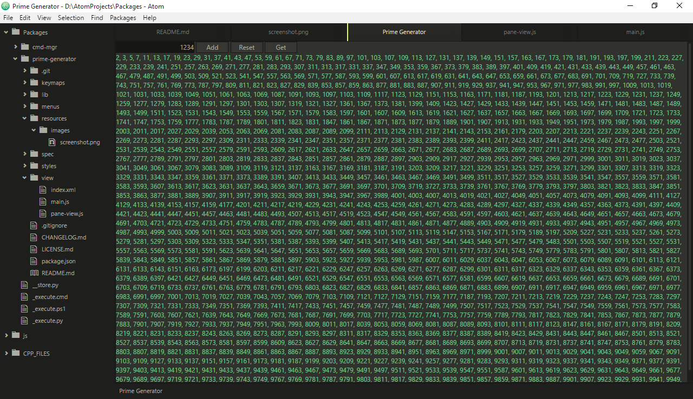

# prime-generator package
This is a test of creating an Atom package, it provides no tools for helping people write code more convenient, I wrote this package just for fun.



## Installation

1. Prerequires:
 - npm version 3.3.6 (Enter `npm --version` in your terminal to check it)
 - Atom version 1.2.0
 - Your Atom must support ECMAScript 6 syntax to be able to use this package

2. Open your terminal
 - Windows: Press <kbd>Ctrl</kbd> + <kbd>R</kbd>, enter `cmd` (or `powershell`).
 - Mac OS X: Press <kbd>Cmd</kbd> + <kbd>Space</kbd>.
 - Linux: Press <kbd>Ctrl</kbd> + <kbd>Alt</kbd> + <kbd>T</kbd>.

3. Install this package to your Atom
 - Step 1: Clone this repository to your computer, suppose that you choose 'path/to/your/directory' as installation directory of this package
 ```bash
cd path/to/your/directory
git clone https://github.com/ksxatompackages/atom-prime-generator.git
 ```
 - Step 2: Link this package to Atom
 ```bash
cd ./atom-prime-generator # After doing Step 1, a directory named 'atom-prime-generator' which contains this package was created inside 'path/to/your/directory'
apm develop prime-generator . # Create a package named 'prime-generator' to directory '.' which is 'atom-prime-generator' above
apm link .
 ```
 - Step 3: Install package's dependencies
 ```
cd path/to/your/directory
mkdir ./node_modules # If 'node_modules' doesn't exist
cd ./node_modules
git clone https://github.com/ksxnodemodules/ksxnodemodules.git
 ```
 - You need to restart your Atom to use this package.

## User Manual

### Open/Close Prime Generator pane
After you open/restart your Atom, there're 2 ways to open the pane:
1. In menu-bar, go to Packages &#x2192; prime-generator &#x2192; Open.
2. Open Command Palettle (by pressing <kbd>Ctrl</kbd> + <kbd>Shift</kbd> + <kbd>P</kbd>), then enter `Prime Generator: Open`.

### User Interface
 - Input box: Representing amount of primes would be printed.
  - Hit <kbd>Enter</kbd> to print prime numbers.
  - Hit <kbd>ESC</kbd> to clear every input and output.
  - Press <kbd>Ctrl</kbd> + <kbd>S</kbd> to open editor pane.
 - Buttons
  - Add: Print more an amount of primes which was represented by value in the input box.
  - Reset: Clear the input box, reset output.
  - Get: Create an editor pane which contains all generated primes.

# Prime Number Definition

## Common definition
 - A **prime number** (or a **prime**) is a natural number greater than 1 that has no positive divisor other than 1 and itself, a natural number greater than 1 that is not a prime number is called a *composite number*.
 - Source: https://en.wikipedia.org/wiki/Prime_number

## Equivalent definition (which is used in this algorithm)
 - 0 and 1 are not prime numbers.
 - 2 is a prime number.
 - A prime number is a natural number greater than 1 which has no prime divisor other than itself.

# Prime Generator

## Idea of algorithm
 - Any number which is not divisible by any less prime number is a prime number
 - The only even prime number is 2, so, only check odd numbers

## Idea of program structure
 - ECMAScript 2015 provides `for...of` loop to iterate iterable object, `prime.js` provides class `PrimeGenerator`, which used to create an iterable object for primes

## Usage of `PrimeGenerator`

### Getting class

#### Installation
Open your terminal, type:
```bash
cd path/to/node_modules
npm install https://github.com/ksxnodemodules/ksxnodemodules.git
```

#### Importation in JavaScript
```javascript
var PrimeGenerator = require('ksxnodemodules').prime.PrimeGenerator;
```

### Constructor
```javascript
new PrimeGenerator(listclass, loopcondition);
```
 - Parameter `listclass` is a constructor/class which should create an iterable object, this object must have `.add(element)` method. If `listclass` was not be specified, use `Set` by default.
 - Parameter `loopcondition` is a function, which receives `n` as the only argument, and returns a boolean. If `loopcondition` was not be specified, use `() => true` by default.
  - Parameter `n`: current checking potential odd number.
  - Return value: if `false`, the iterating process will stop, `true` for otherwise.
 - Return value: an object of `PrimeGenerator`.

### Object usage
```javascript
for (let prime of primegen) {
	statements;
}
```
 - `primegen` is an object of class `PrimeGenerator`.
 - `prime` is a prime number (greater than 2).
 - `statements` is JavaScript statements.
